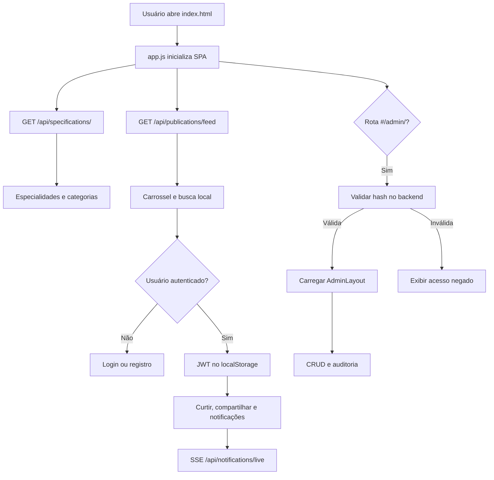

# OlluaS ShowCase - Client

Frontend do OlluaS ShowCase: uma experiência de portfólio em JavaScript modular, com landing page animada, feed de projetos, autenticação, notificações e painel administrativo.

## Stack

- HTML5 e CSS3
- JavaScript com módulos ES
- GSAP 3.12.2 via CDN para animações
- Fetch API para comunicação com o backend
- Server-Sent Events (SSE) para notificações em tempo real
- SVG, Canvas e mídia de imagem/vídeo

O frontend não possui `package.json`, bundler ou servidor de desenvolvimento próprio. Ele deve ser servido por um servidor estático, como a extensão Live Server do VS Code.

## Estrutura

- `public/index.html`: entrada principal da SPA, landing page, navegação pública e container administrativo.
- `public/Projects.html`: página standalone de projetos.
- `src/app.js`: inicialização da aplicação, transições e roteamento administrativo.
- `src/api/client.js`: cliente HTTP, seleção da URL da API e limpeza de sessão em respostas `401`.
- `src/api/authStore.js`: armazenamento em memória do token de login seguro.
- `src/pages`: telas de login, registro, feed, projetos e administração.
- `src/components`: navbar, cards, ferramentas e layout do painel.
- `src/utils`: roteador, autenticação, lista virtual e worker auxiliar.
- `src/animations`: transições entre áreas da interface.
- `src/assets/css`: estilos da aplicação.

## Pré-requisitos

- Um servidor HTTP estático para servir a pasta `Client`.
- A API do `Server` executando em `http://localhost:3000` durante o desenvolvimento local.
- Navegador moderno com suporte a módulos ES, `fetch`, `localStorage`, `IntersectionObserver` e SSE.

## Executando localmente

1. Inicie o backend seguindo as instruções de `Server/README.md`.

2. Sirva a pasta `Client` na porta `5500`. Com o Live Server, abra `Client/public/index.html` e escolha **Open with Live Server**.

3. Acesse:

   ```text
   http://localhost:5500/public/index.html
   ```

O cliente monta a URL da API automaticamente:

- Em `localhost` ou `127.0.0.1`: `http://localhost:3000/api`.
- Em outros hosts: `/api`, esperando que um reverse proxy encaminhe `/api` para o backend.

Para um ambiente servido pelo Caddy, configure também os arquivos estáticos do Client; o `Caddyfile` atual contém apenas o proxy das rotas `/api/*`.

## Funcionalidades

### Área pública

- Landing page com fundo em Canvas e transições GSAP.
- Carregamento de especialidades via `GET /api/specifications/`.
- Feed de publicações via `GET /api/publications/feed`.
- Busca local por título e localidade depois que o feed é carregado.
- Carrossel de projetos com imagem, vídeo e vídeos do YouTube.
- Modal de detalhes, deep link por `#/?open=<id>` e compartilhamento.
- Layout responsivo para desktop e dispositivos móveis.

### Conta e notificações

- Registro via `POST /api/users/register`.
- Login via `POST /api/users/login`.
- Token e usuário persistidos no `localStorage` para a sessão do navegador.
- Curtidas e compartilhamentos enviados aos endpoints protegidos de interações.
- Lista de notificações e conexão SSE em `/api/notifications/live` para usuários autenticados.
- Resposta `401` remove a sessão local e redireciona para `#/login`.

### Administração

- A rota segue o formato `#/admin/<hash>`.
- A hash é validada por `GET /api/admin/verify/<hash>` antes da abertura do painel, salvo quando já existe sessão administrativa válida.
- O painel possui feed administrativo, CRUD de publicações, usuários, auditoria, especialidades, mídia e analytics.
- Cada navegação cria um `AbortController` novo para encerrar listeners da rota anterior.

## Fluxo principal



## API consumida

| Recurso        | Operações do cliente                                       |
| -------------- | ---------------------------------------------------------- |
| Publicações    | Feed, busca local, trending e operações administrativas    |
| Especialidades | Leitura pública e CRUD administrativo                      |
| Usuários       | Registro, login, sessão, gestão administrativa e suspensão |
| Interações     | Curtir e compartilhar                                      |
| Notificações   | Listar, marcar como lida, excluir e receber por SSE        |
| Administração  | Validar hash de acesso ao painel                           |

O cliente envia `Content-Type: application/json` em `POST`, `PUT` e `PATCH`. Quando existe token, inclui `Authorization: Bearer <token>` automaticamente.

## Desenvolvimento

As alterações de interface ficam principalmente em `src/pages`, `src/components` e `src/assets/css`. Como não há etapa de build do frontend, basta recarregar a página servida pelo servidor estático. O backend precisa estar acessível na URL esperada pelo arquivo `src/api/client.js`.

## Observações

- A busca apresentada pela interface é local sobre o feed já carregado; ela não usa o endpoint de busca livre do backend.
- URLs de mídia são verificadas antes de serem inseridas em elementos de imagem, vídeo ou iframe.
- O login administrativo depende tanto da rota protegida no frontend quanto das validações de autenticação do backend.
- Não há configuração de testes automatizados ou lint específica para o Client neste repositório.

## Licença

Este projeto está disponível sob a licença MIT. Consulte o arquivo `LICENSE` na raiz do repositório.
